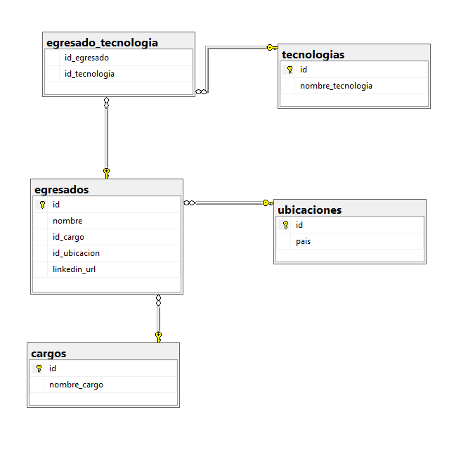
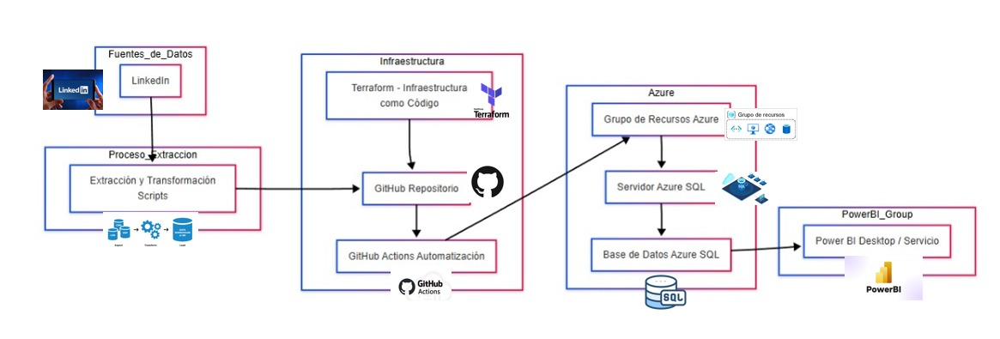

[comment]: 

# **UNIVERSIDAD PRIVADA DE TACNA**  
## **FACULTAD DE INGENIERÍA**  
### **ESCUELA PROFESIONAL DE INGENIERÍA DE SISTEMAS**  

---

# **ANÁLISIS DEL PERFIL PROFESIONAL DE LOS EGRESADOS DE LA EPIS DE LA UPT EN LINKEDIN**

## **Curso:** Inteligencia de Negocios  
## **Docente:** Mag. Patrick Cuadros Quiroga  

---

### **Integrantes:**  
- **Villanueva Mamani, Royser Alonsso**  
- **Hinojosa Mucho, Christian Dennis**  
- **Chite Quispe, Brian Danilo** 
 
  
## Objetivo Principal:
Evaluar el perfil profesional de los egresados de la EPIS de la UPT en LinkedIn para identificar sus habilidades, competencias, sectores laborales y trayectorias profesionales, y proponer estrategias para mejorar su posicionamiento en el mercado laboral.

## Objetivos Secundarios:
✅ Identificar las especializaciones profesionales más comunes entre los egresados registrados en LinkedIn, determinando los sectores o roles en los que predominan.

✅ Analizar las habilidades y competencias técnicas más utilizadas por los egresados según los perfiles registrados en LinkedIn

✅ Determinar la distribución geográfica de los egresados, clasificándola en local, nacional e internacional, para comprender mejor su presencia y alcance laboral.  

## Costos Terraform:

| Concepto                 | Costo Mensual (PEN) |
|-------------------------|---------------------|
| Trabajo con Terraform    | S/ 95               |
| Terraform Cloud (servicio) | S/ 76               |
| **Total**               | **S/ 171**          |

## RoadMap:

